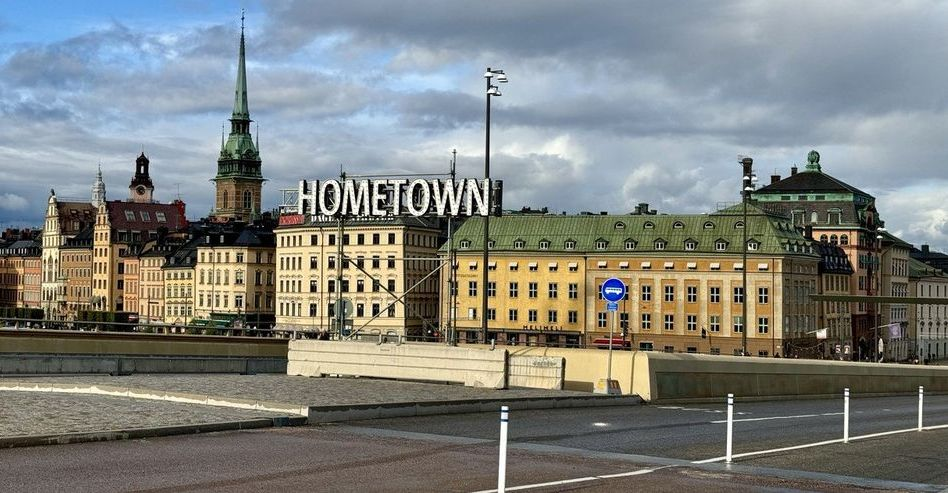

Creative hacker with diverse skills much beyond software construction, a history in systems programming, software validation, programming languages.
When I'm part of projects that stimulate my imagination I tend to make unpredictably-good things happen.

* I enjoy writing, and sometimes think I'm pretty ok at it. Like my code, I like my words to be a mixture of engineering and art.
* Brew Coffee and love making vegan food and deseerts
* Obsessed with star and rockets 🚀
* Music things like Playing Guitar & Piano
* Selling guitars nad musical stuff
* Training parrots and cats. Want some bulldog

Also making [progress page](https://j69.github.io/progress.md)
